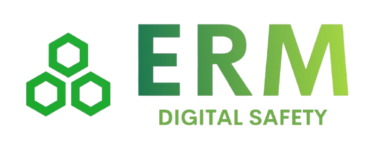

<!--  -->

<!-- # **Kites.JS** -->

<h1>e-EMR.AI-NGX</h1>

Bệnh án AI-NGX & Mẫu phiếu động On-Chain

- 🚀 EMR Độc lập (standalone)
- ⚡️️ Kết nối với HUB Cloud Platform
- 💎 Tương thích với mọi HIS, LIS, PACS.
- 🔥 Xuất dữ liệu HL7 CDA, FIHR, PDF.
- 📼 Backup định kỳ và lưu trữ tự động.
- ⏱ Tích hợp AI, LLM và Blockchain.

  <a href="https://hsdt.github.io/ngx-playground">EMR Ngx Playground</a>
  <a href="#/README">Hướng Dẫn</a>

